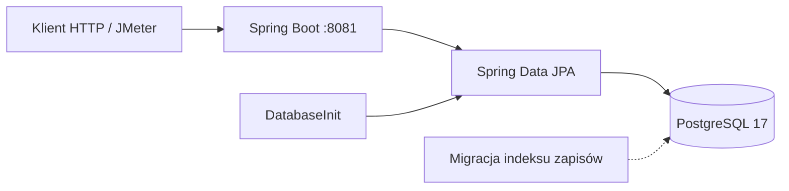

# University Enrollment API

**System zapisów na zajęcia uczelniane: Spring Boot, PostgreSQL i pomiary obciążenia na dużej, spójnej bazie.**

[](https://adoptium.net/)
[](https://spring.io/projects/spring-boot)
[](https://www.postgresql.org/)
[](https://docs.docker.com/compose/)

REST API do grup zajęciowych i zapisów studentów. Model obejmuje uczelnie, wydziały, kierunki, sale, prowadzących i etapy studiów. Dane startowe generuje `DatabaseInit`. Pełny zestaw ma **10 uczelni**; domyślny start lokalny jest mniejszy, żeby laptop nie kończył seeda brakiem pamięci.

## Co warto zobaczyć

- Model uczelniany w JPA: relacje, klucz złożony zapisu `(student_id, course_group_id)` oraz `@MapsId` przy studencie.
- Zapis jednym poleceniem SQL: `INSERT … ON CONFLICT DO NOTHING` zamiast osobnego SELECT i INSERT.
- Dwie skale danych: szybki profil deweloperski i pełny zestaw 10 uczelni ładowany partiami.
- Test obciążeniowy JMeter (profil `benchmark`) i `pg_stat_statements` do wskazania wolnych zapytań.
- Indeks `idx_enrollments_course_group_id` pod liczenie zapisów w grupie.

## Skala danych

Liczby wynikają ze stałych w `DatabaseInit` i z parametrów `tools/run_seed_batch.ps1`.

| | Start lokalny (domyślne `seed.*`) | Pełny zestaw (skrypt batch) |
|---|---:|---:|
| Uczelnie | 3 | **10** |
| Wydziały | 6 | 100 |
| Budynki | 12 | 1 000 |
| Sale | 120 | **50 000** |
| Kierunki | 6 | 100 |
| Przedmioty | 18 | **1 000** |
| Prowadzący | 12 | 200 |
| Etapy studiów | 36 | 600 |
| Grupy zajęciowe | 36 | **10 000** |
| Studenci | 60 | **10 000** |
| Limit zapisów na grupę | 5 | 10 |

Pełny zestaw: 10 uczelni × 10 wydziałów × 10 budynków × 50 sal, 10 przedmiotów × 10 grup, 100 studentów na kierunek, 3 lata × 2 semestry. Nazwy uczelni są w kodzie (m.in. Politechnika Warszawska, Uniwersytet Jagielloński, Politechnika Wrocławska, AGH). Prowadzący zostają przy domyślnych 2 na wydział, bo skrypt batch tego parametru nie nadpisuje.

Górna granica zapisów przy pełnej skali to 100 000 (10 na każdą z 10 000 grup). Seeder losowo pomija część kandydatów, więc faktyczna liczba bywa niższa.

Profil lokalny uruchamia się sam przy pustej bazie. Pełne 10 uczelni ładuje się partiami — jedna uczelnia na proces — skryptem `tools/run_seed_batch.ps1`. Szczegóły: [tools/SEED_INSTRUCTIONS.md](tools/SEED_INSTRUCTIONS.md).

## Architektura



Schemat powstaje z encji (`ddl-auto: update`). Flyway jest wyłączony; skrypt `V2__optimize_enrollments.sql` opisuje indeks używany przy liczeniu zapisów. Postgres w Dockerze nasłuchuje na hoście na porcie **12345**.

Pakiety:

| Pakiet | Rola |
|---|---|
| `structure` | Uczelnia, wydział, budynek, sala, kierunek |
| `teaching` | Przedmiot, etap, grupa, zapis, `CourseGroupController` |
| `users` | Użytkownik, student, prowadzący, `StudentController` |
| `common` | Seed (`DatabaseInit`) i `GET /api/health` |
| `benchmark` | Jednopoziomowy klient HTTP `ApiBenchmark` |

## Szybki start

Wymagane: JDK 21, Docker, Docker Compose. Maven jest w repozytorium (`mvnw.cmd`).

```powershell
docker compose up -d
.\mvnw.cmd spring-boot:run
```

API: [http://localhost:8081](http://localhost:8081)

```powershell
curl.exe http://localhost:8081/api/health
curl.exe http://localhost:8081/api/course-groups/count
```

Pełna skala (Postgres musi już działać):

```powershell
.\tools\run_seed_batch.ps1 -TotalUniversities 10 -UniversitiesPerBatch 1
```

Inny port HTTP: `.\mvnw.cmd spring-boot:run "-Dspring-boot.run.arguments=--server.port=8082"`

## API

Identyfikatory grup i studentów to **UUID**.

| Metoda | Ścieżka | Odpowiedź |
|---|---|---|
| `GET` | `/api/health` | `{"status":"ok"}` — bez odpytywania bazy |
| `GET` | `/api/course-groups/count` | liczba grup |
| `GET` | `/api/course-groups` | lista grup (przy 10 000 grup użyj `/count`) |
| `GET` | `/api/course-groups/{groupId}` | jedna grupa albo 404 |
| `GET` | `/api/course-groups/{groupId}/students` | liczba zapisów w grupie |
| `POST` | `/api/course-groups/{groupId}/enroll` | 201 zapis, 409 duplikat, 400 brak studenta lub grupy |
| `DELETE` | `/api/course-groups/{groupId}/unenroll/{studentId}` | 200 usunięcie, 404 brak zapisu |
| `GET` | `/api/students` | lista studentów |

Zapis:

```http
POST /api/course-groups/{groupId}/enroll
Content-Type: application/json

{"studentId": "550e8400-e29b-41d4-a716-446655440000"}
```

```json
{"success": true, "message": "Student zapisany na zajęcia"}
```

`studentId` to `students.user_id`. Gotowy przebieg curl/PowerShell: [docs/prezentacja-api.md](docs/prezentacja-api.md).

## Wydajność

Profil `benchmark` wyłącza log SQL i podnosi pulę połączeń oraz wątki Tomcata.

```powershell
.\mvnw.cmd spring-boot:run "-Dspring-boot.run.profiles=benchmark"
.\tools\run_jmeter_wyklad.ps1 -LikeColleague -HoldSec 90 -RampSec 15
```

Wynik ląduje w `tools/benchmark_jmeter.csv`. Porównanie przed i po optymalizacji: `.\tools\compare_optimization.ps1`. Instrukcja: [tools/BENCHMARKING.md](tools/BENCHMARKING.md).

Jednopoziomowy klient (po `.\mvnw.cmd -DskipTests compile`):

```powershell
java -cp target/classes pwr.zbd.projekt.benchmark.ApiBenchmark http://localhost:8081 HEALTH 10 100
```

Operacje: `HEALTH`, `GET_BY_ID`, `ENROLL`, `UNENROLL`, `MIXED`, `GET_ALL`. Przy pełnej skali pomijaj `GET_ALL` — zwraca wszystkie grupy w jednym JSON-ie.

Najwolniejsze zapytania (PostgreSQL 17, kolumny `*_exec_time`):

```sql
SELECT left(query, 120) AS query, calls,
       round(mean_exec_time::numeric, 2) AS mean_ms,
       round(max_exec_time::numeric, 2)  AS max_ms
FROM pg_stat_statements
ORDER BY mean_exec_time DESC
LIMIT 10;
```

```powershell
docker exec -it zbd_postgres psql -U admin -d zdb
```

Reset: `SELECT pg_stat_statements_reset();`

## Baza

```sql
SELECT
  (SELECT count(*) FROM universities)   AS universities,
  (SELECT count(*) FROM faculties)      AS faculties,
  (SELECT count(*) FROM rooms)          AS rooms,
  (SELECT count(*) FROM courses)        AS courses,
  (SELECT count(*) FROM course_groups)  AS course_groups,
  (SELECT count(*) FROM students)       AS students,
  (SELECT count(*) FROM enrollments)    AS enrollments;
```

Diagram ER z encji: `python tools/generate_erd.py` → `docs/db-diagram.mmd`.

## Układ repozytorium

```
├── docker-compose.yml          # PostgreSQL 17, port hosta 12345, pg_stat_statements
├── init-db.sql                 # rozszerzenie pg_stat_statements
├── src/main/java/pwr/zbd/projekt
│   ├── common/                 # DatabaseInit, HealthController
│   ├── structure/              # uczelnia, wydział, budynek, sala, kierunek
│   ├── teaching/               # grupy, zapisy, CourseGroupController
│   ├── users/                  # student, prowadzący, StudentController
│   └── benchmark/              # ApiBenchmark
├── src/main/resources
│   ├── application.yaml
│   ├── application-benchmark.yaml
│   └── db/migration/           # m.in. indeks na enrollments
└── tools/                      # seed partiami, JMeter, ERD
```

## Gdy coś nie wstaje

Port 8081 zajęty — uruchom z `--server.port=8082` (komenda wyżej).

Postgres nie odpowiada — `docker ps`, potem `docker logs zbd_postgres`. Kontener nazywa się `zbd_postgres`. Login `admin` / `admin`, baza `zdb`.

`No compiler is provided` — `JAVA_HOME` musi wskazywać na JDK 21, nie na samo JRE.

Seed nic nie dopisuje — przy wyłączonym `seed.batchMode` drugi start pomija generowanie, jeśli w `universities` są już wiersze.

## Stack

Java 21 · Spring Boot 4.0.4 · Spring Data JPA · PostgreSQL 17 · Flyway (migracje w repo, przy starcie wyłączone) · Docker Compose · JMeter 5.6 · JavaFaker
